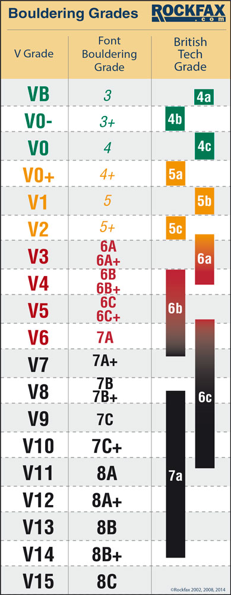

# AlexaClimbingGradeConverter
An AWS Lambda (Server-less) program I wrote so that I could ask my Alexa to convert bouldering grades for me.

In bouldering (the climbing without ropes), there are two popular systems for grading the difficulty of climbs: The V-Grade system which is the most popular in the US, and the Font Grade system which is mostly popular in Europe. Converting between the two can be a headache sometimes, so I thought: "Why not just ask my Alexa?" Surprisingly enough, Alexa had no clue what I was talking about, so I decided to make my own custom functions for Alexa to make these grade conversions easier for me.

Figuring out how to use AWS' Lambda technology was pretty fun. I got to learn how to host server-less code in the cloud, and see the effects of my program in real time. 

One problem I encountered was that sometimes in the online Alexa simulation where you would type in commands, you would get an error saying "There was an issue processing your input." Refreshing the page until the command worked seemed to do the trick, but I was not sure what could have caused it in the first place. The issue was consistent across browsers, and I did not have any antivirus or firewall exceptions that could have caused the issue, as some internet forums suggested. At first I believed the cause of the issue to be having multiple testing tabs open at once, but closing the duplicates did not seem to change anything. 

Maybe in the future when I work on server-less code again I can find the genesis of this issue!

Here is a picture of the conversion chart I used:

